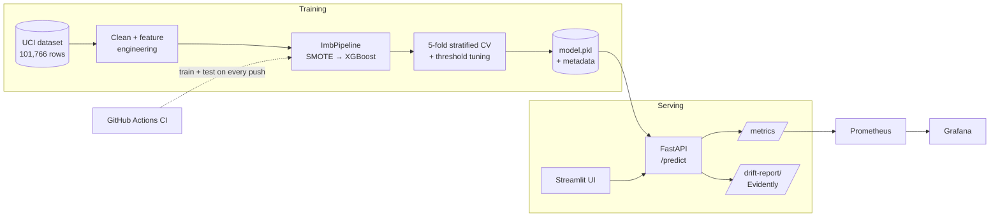

# 🏥 Hospital Readmission Risk Predictor


🚀 **Live App:** [Try it here](https://hospital-readmission-bz7hqjeye7fgsppfs3pwqm.streamlit.app) *(the app and API may take ~30–60s to wake up)*

End-to-end ML system predicting **30-day hospital readmission risk** for diabetic patients: model training, FastAPI serving, drift detection, Prometheus metrics, Docker, and CI/CD, going past `model.predict()` to what it takes to run a model in production.

📝 Write-up: [Stop Ending at model.predict()](https://medium.com/@bhardwajpreeti357/stop-ending-at-model-predict-b7ee3c0ee20e)

---

## 🎯 Problem

Hospitals are penalized financially for high readmission rates. Identifying which patients are at risk *before* discharge allows targeted follow-up care. This project predicts the probability that a patient is readmitted within 30 days, using the **UCI Diabetes 130-US Hospitals dataset** (101,766 encounters, 1999–2008).

---

## 🏗️ Architecture



---

## ⚙️ ML Pipeline

1. **Remove death/hospice discharges.** Readmission isn't clinically meaningful for these patients, so keeping them would distort the target
2. **Target:** 1 if readmitted within 30 days (`<30`), else 0
3. **Feature engineering:** age bucket → numeric, flags for medication change, diabetes medication, insulin dose change, and abnormal A1C
4. **80/20 stratified train/test split**
5. **SMOTE inside an `ImbPipeline`**, so oversampling happens only on each training fold and synthetic samples never leak into validation data
6. **XGBoost** (150 trees, depth 5, lr 0.1) evaluated with **5-fold stratified cross-validation**
7. **Threshold tuning for recall** (target recall ≥ 65%), because missing a true readmission costs more clinically than a false alarm
8. **SHAP (TreeExplainer)** for feature importance

---

## 📊 Results & Honest Context

| Metric | Score |
|---|---|
| **Mean CV AUC** (5-fold) | **0.581** |
| **Test AUC** | **0.582** |
<!-- TODO: update after re-running with the out-of-fold threshold fix -->
| Tuned threshold | 0.252 |

This AUC may look modest, and that's expected, not a flaw. Published research on this exact dataset reports XGBoost at **AUC 0.667** and logistic regression at 0.642 ([source](https://pubmed.ncbi.nlm.nih.gov/40385730/)). Readmission is a genuinely hard, weakly-separable problem. My model uses only 16 features, and the gap to published results is mainly the features left out (e.g. diagnosis codes). I chose to report honest, reproducible numbers rather than chase an inflated metric.

### 🔍 Top Predictors (SHAP)
<!-- TODO: check this list matches the "Top features by SHAP importance" output of train_model.py -->
1. Admission type
2. Whether medication was changed during stay
3. Number of medications
4. Abnormal A1C result
5. Number of procedures

---

## 📡 Serving & Monitoring

| Endpoint | Description |
|---|---|
| `POST /predict` | Returns readmission label (`YES`/`NO`) + probability |
| `GET /health` | API health + number of predictions logged |
| `GET /metrics` | Prometheus metrics: `predictions_total`, `prediction_latency_seconds`, `drift_detected_total` |
| `GET /drift-report` | Evidently data-drift report comparing recent requests (last 200) to training reference data |

- Request schemas are validated with **Pydantic**
- The drift report needs at least 10 predictions. If more than 30% of columns drift, `drift_detected_total` increments
- **Prometheus** scrapes `/metrics` every 15 seconds; **Grafana** visualizes prediction rate, latency and drift alerts

<!-- TODO: add a Grafana screenshot once the monitoring stack is running -->
<!--  -->

---

## ✅ Testing & CI/CD

Every push and pull request to `main` triggers **GitHub Actions**, which:
1. Installs dependencies
2. Generates a **synthetic dataset** with the real schema, so CI doesn't depend on the 19 MB source file
3. Runs the full training pipeline end to end
4. Runs the **pytest** API test suite (`/`, `/predict`, high-risk input bounds)

This checks that the training code, saved model format and API stay compatible on every change. Model *quality* is measured separately on the real data.

---

## 🛠️ Tech Stack

| Layer | Tools |
|---|---|
| ML | XGBoost, scikit-learn, imbalanced-learn (SMOTE), SHAP |
| Serving | FastAPI, Pydantic, Uvicorn |
| UI | Streamlit |
| Monitoring | Evidently, Prometheus, Grafana |
| Infra | Docker, Docker Compose, GitHub Actions |

---

## 🚀 Running Locally

```bash
pip install -r requirements.txt
python notebooks/train_model.py
uvicorn app.main:app --reload
```
Open http://127.0.0.1:8000/docs for interactive API testing.

### 🖥️ Streamlit UI
With the API running, in a second terminal:
```bash
streamlit run app/streamlit_app.py
```

### 🐳 Docker
```bash
docker build -t readmission-predictor .
docker run -p 8000:8000 readmission-predictor
```
The container retrains the model on startup, so the first launch takes a minute.

### 📡 Full monitoring stack (API + Prometheus + Grafana)
```bash
cd monitoring
docker compose up -d
```
- API: http://localhost:8000/docs
- Prometheus: http://localhost:9090
- Grafana: http://localhost:3000 (admin / admin); the Prometheus data source is pre-configured

---

## ⚠️ Limitations

- **Modest AUC (0.58)** because of a small feature set; diagnosis codes and richer history features are not used yet
- **Prediction log is in memory**, so drift history resets when the API restarts
- **Drift is checked on request**, not on a schedule
- **No model versioning or registry** — retraining overwrites `model.pkl`

## 🔮 Next Steps

- Add ICD-9 diagnosis groupings, which published work shows are strong predictors
- Persist predictions to a database for durable drift history
- Schedule drift checks and add Grafana alerting
- Track experiments and model versions with MLflow

---

## 📁 Project Structure

```
hospital-readmission-predictor/
├── app/
│   ├── main.py              # FastAPI app: /predict, /health, /metrics, /drift-report
│   ├── predict.py           # Model loading + feature engineering (mirrors training)
│   ├── schemas.py           # Pydantic request/response schemas
│   ├── streamlit_app.py     # Streamlit UI
│   └── reference_data.csv   # Reference data for drift detection
├── data/diabetic_data.csv   # UCI Diabetes 130-US Hospitals dataset
├── model/                   # Trained pipeline + metadata (threshold, encoder)
├── notebooks/train_model.py # Training pipeline
├── monitoring/              # Prometheus config, Grafana provisioning, docker-compose
├── tests/test_api.py        # API tests
├── Dockerfile
└── .github/workflows/ci.yml
```

---

## ⚠️ Disclaimer

This is an educational project. It is not a clinical decision tool and must not be used for real patient care.

---

## 👩‍💻 Author

**Preeti Bhardwaj** — Software Developer | GenAI & Agentic Systems | RAG & LLM Engineering

[Portfolio](https://mistyvisty.github.io/) · [GitHub](https://github.com/mistyvisty) · [Medium](https://medium.com/@bhardwajpreeti357)
